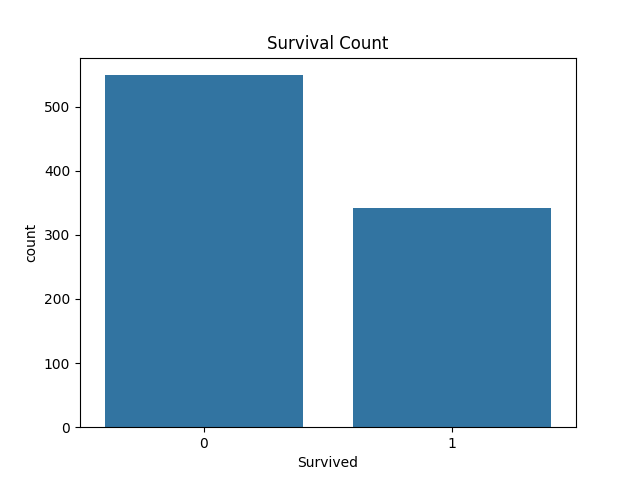
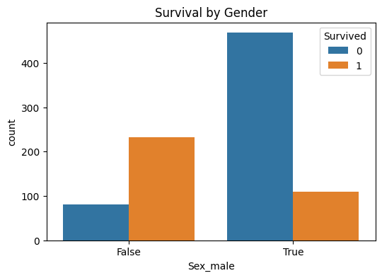
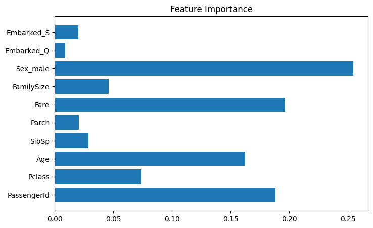

# Titanic Survival Prediction 
## Problem Statement
  The goal of this project is to predict passenger survival on the Titanic using machine learning techniques.
Steps Performed

## Data cleaning and missing value handling
  Exploratory Data Analysis (EDA)
  Feature engineering
  Model training and evaluation
  Feature importance analysis

## Key Insights
  Female passengers had higher survival rate.
  Higher class passengers had better survival.
  Fare and age were important factors.

## Technologies Used
Python, Pandas, NumPy, Matplotlib, Seaborn, Scikit-learn.

## Kaggle Profile
 https://www.kaggle.com/lotusrisenithish

## Exploratory Data Analysis

### Survival Count 0 as male 1 as Female

### Survival by Gender

## Model Interpretation

### Feature Importance

